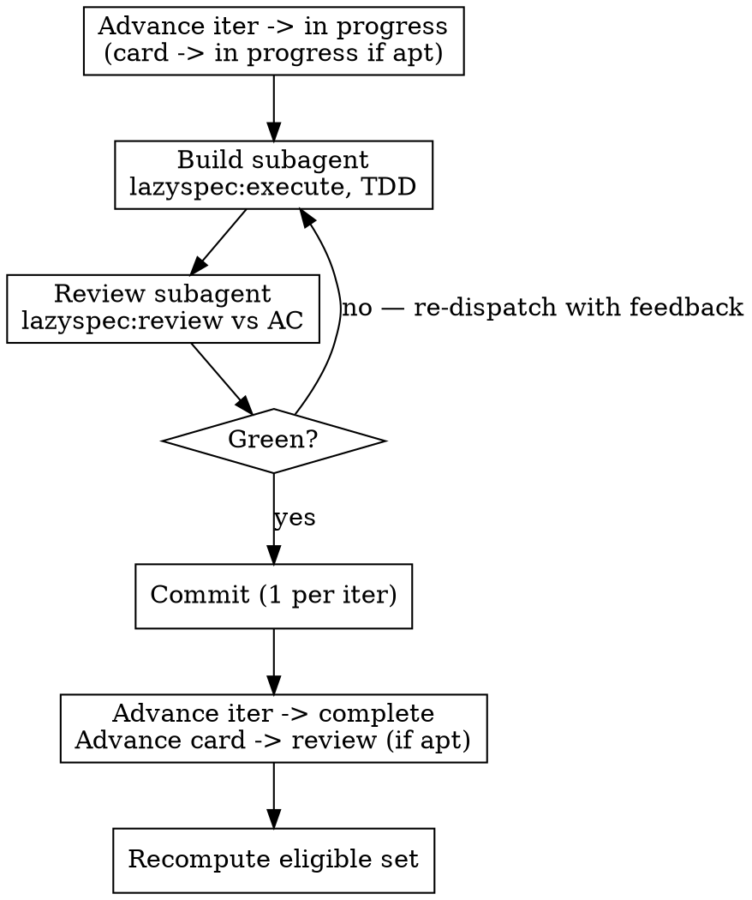

# Orchestrating Iterations

## Overview

You are handed a batch of iterations (or plans/work slices) and must drive them all to done in one run. This skill is the **orchestration loop**: resolve order from the dependency graph, then for each iteration run build → review → commit → advance, retrying review until green, until every unit is complete.

You are the orchestrator, not the implementer. Each iteration's build and each review run in their own subagent. You own ordering, status transitions, commits, and the done check.

**REQUIRED SUB-SKILLS:** `lazyspec:execute` (the per-iter build loop), `lazyspec:advance` (status transitions), `lazyspec:review` (the gate). Build subagents pull `testing`, `refactoring`, `type-driven-design` per the iteration's nature.

## Resolve order from edges, not the table

The list you were given is **not** the execution order. Order comes from the `blocks`/`blocked-by` relations on the actual docs.

1. Read the real edges: `lazyspec list iteration --json` and `lazyspec show <ID>` (or `lazyspec context`). Do not trust the prompt's table ordering or the iteration numbers.
2. Build the DAG and topologically sort. An iteration is **eligible** iff every iteration it is `blocked-by` is already `complete`.
3. Run sequentially in topo order — even when branches are independent. Iterations in a batch usually share files (router, app, store); parallel subagents collide and break "1 commit per iter". Take the cheaper deterministic path.

## The per-iteration loop

For each eligible iteration, in topo order:

The review→build edge is the **retry loop** (often run inside a `/goal` loop): a failed review re-dispatches the build subagent with the review feedback, then re-reviews. Never commit or advance on a failing review. Only green exits the loop.

## Status-transition contract

This is where orchestration goes wrong. Each transition has a specific target — do not collapse them.

| Unit              | Start of iter                  | After green review + commit                   |
| ----------------- | ------------------------------ | --------------------------------------------- |
| **Iteration doc** | `in progress`                  | `complete`                                    |
| **Story / card**  | `in progress` (if appropriate) | **`review`** (if appropriate), NOT `complete` |

The card moves to `review`, not `complete` — completing a card is a human/downstream decision, and a card may own iterations outside this batch. Advance the card only when all of its in-batch iterations are done and `review` is its appropriate next status. If a card owns iterations not in this batch, leave it and note it.

Sequencing within the iter: commit first (after green review), then advance the iteration doc to `complete`, then advance the card to `review`. Let `lazyspec:advance` check the type's gates at each transition.

## Commits

One commit per iteration, after its review is green — never before, never batched across iterations. Stage only that iteration's changes. If on the default branch, branch first before the first commit.

## Done

Done iff **every** iteration doc in the batch is `complete` AND every in-batch card has advanced to its appropriate status (`review` unless noted). Verify with a final `lazyspec list --status` / `lazyspec status` and confirm one commit per iteration landed. Report the resolved order, the commits, per-iter review outcomes, and any sandbox blockers you had to stop on.

## Common Mistakes

- **Advancing cards to `complete`.** The card target is `review`. Completion is downstream.
- **Ordering by the given table.** Order comes from `blocked-by` edges read off the docs.
- **Committing or advancing on a red review.** Retry the build subagent with feedback; only green exits.
- **Batched or pre-review commits.** One commit per iter, after green.
- **Doing the build yourself.** Build and review each run in their own subagent; you orchestrate.
- **Completing a card whose iterations span batches.** Leave it in progress and note it.
