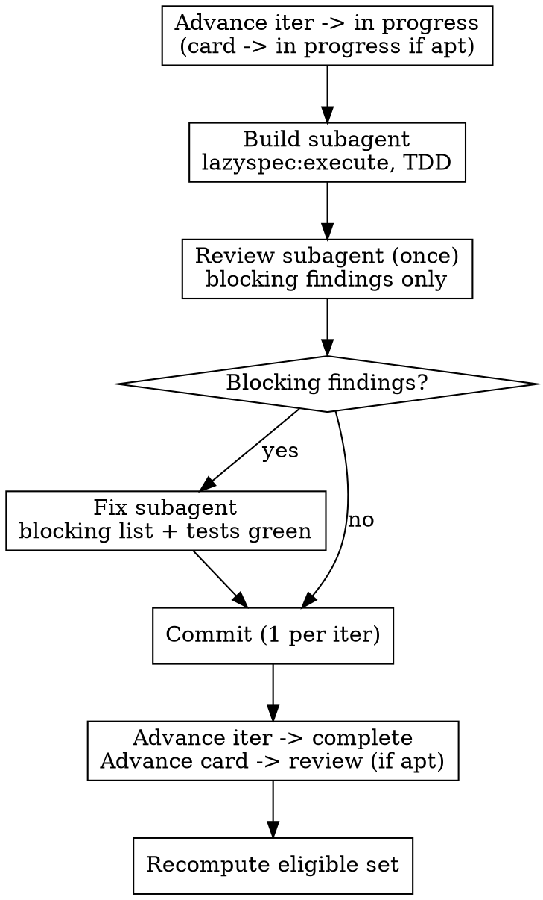

# Orchestrating Iterations

## Overview

You are handed a batch of plans/work slices (e.g. iterations, deltas) and must drive them all to done in one run. This skill is the **orchestration loop**: resolve order from the dependency graph, then for each iteration run build → one blocking-only review → fix → commit → advance; once every iteration is done, run a single end-to-end nit pass over the whole chunk.

Review happens at two points and only two: **once per iteration, blocking findings only**, and **once at the end of the chunk, comprehensively**. There is no review cycle inside an iteration. The chunk-level pass is where breadth comes from.

You are the orchestrator, not the implementer. Each iteration's build and each review run in their own subagent. If a work slice is very specific and detailed, you should use a model like opus, if it is more vague, consdier fable. You own ordering, status transitions, commits, and the done check.

**REQUIRED SUB-SKILLS:** `lazyspec:execute` (the per-iter build loop), `lazyspec:advance` (status transitions), `lazyspec:review` (both passes). Build subagents pull `testing`, `refactoring`, `type-driven-design` per the iteration's nature.

## Resolve order from edges, not the table

The list you were given is **not** the execution order. Order comes from the `blocks`/`blocked-by` relations on the actual docs.

1. Read the real edges: `lazyspec list iteration --json` and `lazyspec show <ID>` and `lazyspec context`. Do not trust the prompt's table ordering or the iteration numbers.
2. Build the DAG and topologically sort. An iteration is **eligible** iff every iteration it is `blocked-by` is already `complete`.
3. Run sequentially in topo order — even when branches are independent. Iterations in a batch usually share files (router, app, store); parallel subagents collide and break "1 commit per iter". Take the cheaper deterministic path.

## The per-iteration loop

For each eligible iteration, in topo order:

Note the missing edge: **nothing returns to review.** The fix subagent's output goes straight to the commit. Its gate is the test suite (and the iteration's AC as stated in the blocking list), not another reviewer.

## The two review passes

| | **Per-iteration** | **End of chunk** |
| --- | --- | --- |
| When | Once, after the build subagent finishes | Once, after the last iteration is `complete` |
| Scope | That iteration's diff vs that iteration's AC | Whole chunk's combined diff, end to end |
| Emits | Blocking findings only | Everything — nits, naming, duplication, dead code, seams, inconsistency across iterations |
| Blocking = | AC unmet, test failing/missing for stated AC, broken build, wrong behaviour, data loss, security hole | same, if any surface here |
| Non-blocking | Not emitted — dropped, the chunk pass will catch it | Fixed in the cleanup commit |
| Re-review | None | None |

Say "blocking findings only — style, naming, duplication and structure are out of scope for this pass" in the per-iter review dispatch. A reviewer not told this will hand you nits, and nits in an iteration review turn into review cycles.

**Per-iter blocking findings:** dispatch one fix subagent with the blocking list. It fixes, runs the tests, reports. Then commit. If the fix subagent reports it cannot satisfy a blocking finding, stop the chunk and report — do not commit around it, do not loop.

## Status-transition contract

This is where orchestration goes wrong. Each transition has a specific target — do not collapse them.

| Unit              | Start of iter                  | After commit                                  |
| ----------------- | ------------------------------ | --------------------------------------------- |
| **Iteration doc** | `in progress`                  | `complete`                                    |
| **Story / card**  | `in progress` (if appropriate) | **`review`** (if appropriate), NOT `complete` |

The card moves to `review`, not `complete` — completing a card is a human/downstream decision, and a card may own iterations outside this batch. Advance the card only when all of its in-batch iterations are done and `review` is its appropriate next status. If a card owns iterations not in this batch, leave it and note it.

Sequencing within the iter: commit first (after blocking findings are fixed), then advance the iteration doc to `complete`, then advance the card to `review`. Let `lazyspec:advance` check the type's gates at each transition.

## Commits

One commit per iteration, after its blocking findings are cleared — never before, never batched across iterations. Stage only that iteration's changes. If on the default branch, branch first before the first commit.

Plus exactly one cleanup commit at the end of the chunk, from the nit pass.

## End of chunk: the comprehensive pass

Every iteration `complete` does **not** mean the chunk is done. Run this before the done check, once:

1. Dispatch one review subagent over the chunk's whole diff (`git diff <base>..HEAD`) plus every iteration doc in the batch. Brief it as comprehensive and end-to-end: nits, naming, duplication across iterations, dead code and scaffolding left behind, inconsistent patterns between iterations, missing tests, seams that drifted. Explicitly in scope — this is the pass that was deferred.
2. Dispatch one fix subagent with the findings. Tests stay green.
3. One cleanup commit for the whole chunk.
4. If the pass surfaces something **blocking** (AC actually unmet, broken integration between iterations), fix it in that same cleanup commit and say so in the report. If it is too large to fix here, stop and report it rather than filing it silently.

One review, one fix, one commit. No cycle here either.

## Done

Done iff **every** iteration doc in the batch is `complete`, every in-batch card has advanced to its appropriate status (`review` unless noted), **and the end-of-chunk pass has run with its cleanup commit landed**. Verify with a final `lazyspec list --status` / `lazyspec status` and confirm one commit per iteration plus the cleanup commit landed. Report the resolved order, the commits, per-iter blocking findings, the chunk pass findings, and any sandbox blockers you had to stop on.

## Common Mistakes

- **Advancing cards to `complete`.** The card target is `review`. Completion is downstream.
- **Ordering by the given table.** Order comes from `blocked-by` edges read off the docs.
- **Re-reviewing inside an iteration.** One review per iter. The fix subagent's gate is the tests, not a second reviewer.
- **Letting nits hold up an iteration.** Naming, duplication and structure do not block a per-iter commit. They belong to the chunk pass.
- **Stopping at the last iteration.** All-complete is not done. The chunk pass and its cleanup commit are part of done.
- **Running the comprehensive pass per iteration.** It runs once, over the whole chunk diff. Per-iter it would be the review cycle you just removed.
- **Committing or advancing with blocking findings open.** Fix them, or stop the chunk and report.
- **Batched or pre-review commits.** One commit per iter, plus one cleanup commit.
- **Doing the build yourself.** Build and review each run in their own subagent; you orchestrate.
- **Completing a card whose iterations span batches.** Leave it in progress and note it.
