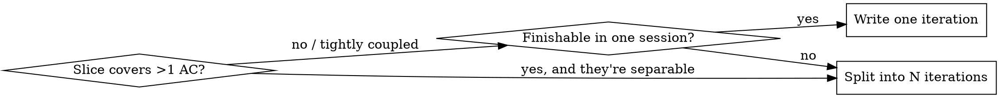

# Writing Iterations

## Overview

An iteration document hands one session-sized slice of work to a coding agent. It is a **thin pointer plus a bounded task list** — not a re-derivation of the spec, not a copy of the story.

Core principle: **the iteration adds only what is not already written down elsewhere.** Everything in a linked story, spec, or convention doc is referenced by pointer, never reproduced. What the iteration contributes is the _slice boundary_ and the _ordered tasks_ to execute it.

This is technology-agnostic in spirit but assumes software work (files, tests, PRs). It is a lazyspec `iteration` type by default, but the discipline applies to any plain-markdown slice handed to an agent.

Scope: authoring iterations. Co-writing with the user is out of scope (the user drives that).

## The Iteration Contract

An iteration document IS these slots, in this order. Fill each; omit nothing required.

| Slot                       | Required | Contains                                                                                                                                   | Does NOT contain                                                 |
| -------------------------- | -------- | ------------------------------------------------------------------------------------------------------------------------------------------ | ---------------------------------------------------------------- |
| **Objective**              | yes      | One line: the behaviour change this slice delivers.                                                                                        | Background, justification, restated story.                       |
| **Context refs**           | yes      | Links/paths to the story or card, the spec, conventions, and the specific files to touch.                                                  | The _contents_ of those docs. Point, don't paste.                |
| **Satisfies**              | yes      | The external AC/story IDs this slice satisfies (e.g. `API-412 AC1, AC3`).                                                                  | The AC text. ACs live on the card/story; reference by ID.        |
| **Tasks**                  | yes      | Ordered, concrete work items, sized to one agent session.                                                                                  | Spec algorithm steps re-explained. Reference the spec section.   |
| **Out of scope**           | yes      | Explicit boundaries — what this slice does NOT touch, and which ACs are deferred to later iterations.                                      | —                                                                |
| **Principles/conventions** | yes      | Pointers to the project conventions and external principles that govern the work (e.g. `docs/CONVENTIONS.md`, a type-driven-design skill). | Re-stated rules already in those docs.                           |
| **Verification**           | optional | Only slice-specific checks.                                                                                                                | Generic "run the tests" — that comes from the card/story review. |

If a fact is in a doc you linked, you have already communicated it. Writing it again is the bloat failure.

## Sizing: One Agent Session

The binding constraint is **one uninterrupted agent session without context exhaustion.** A slice that spans several acceptance criteria, introduces a new subsystem _and_ wires it _and_ covers every edge case, is too big.

Decision when scoping a slice:



When you split, each iteration names which ACs it satisfies and lists the deferred ACs under Out of scope. Splitting is the default response to a multi-AC story, not the exception.

## Worked Example

Story `API-412` ("Public API rate limiting") has 5 ACs and a spec at `docs/specs/rate-limiting.md`. The wrong move is one iteration covering all 5. Here is the _first_ of several iterations:

```markdown
---
type: iteration
id: ITER-API-412-01
story: API-412
spec: docs/specs/rate-limiting.md
---

# Iteration: anonymous per-IP rate limiting

## Objective

Limit unauthenticated requests by client IP using the Redis sliding-window counter.

## Satisfies

API-412 AC1, AC3, AC4 (anon path only). AC2, AC5 deferred — see Out of scope.

## Context

- Story + ACs: API-412 (tracker)
- Algorithm + key scheme + config names: docs/specs/rate-limiting.md §"sliding-window"
- Conventions: docs/CONVENTIONS.md (TDD, zod config, middleware unit-tested)
- Touch: src/middleware/rate-limit.ts (new), src/app.ts (mount after auth),
  src/config/env.ts (add RATE_LIMIT_ANON, RATE_LIMIT_WINDOW_SEC), src/lib/redis.ts (reuse client)

## Tasks

1. Add the anon config vars to the zod schema in src/config/env.ts per spec defaults.
2. Test-first: write test/middleware/rate-limit.test.ts for the anon-by-IP cases.
3. Implement the middleware for the anon path only; mount after auth in src/app.ts.

## Out of scope

- AC2 (authenticated per-key limiting) → ITER-API-412-02.
- AC5 (restart durability verification) → covered once auth path lands.
- Atomic INCR+EXPIRE hardening → ITER-API-412-03 if the spec race matters.

## Verification

Boundary case: 60th anon request passes, 61st returns 429 with Retry-After.
```

Note what is absent: no reproduced algorithm steps, no copied AC text, no config table — all live in the spec, referenced by section. The doc is a slice boundary plus three tasks.

## Common Mistakes

- **Restating the spec.** Reproducing the algorithm, config table, or identity scheme that the linked spec already defines. Reference the spec section instead.
- **Copying the AC text.** ACs live on the card/story. List the IDs under Satisfies; do not paste the text or add a checkbox copy.
- **One mega-iteration.** Bundling every AC. If a story has N separable ACs, expect roughly N iterations.
- **Re-explaining conventions.** "Use TDD, validate config with zod" belongs in `docs/CONVENTIONS.md`; link it.
- **Background prose.** Justification and history belong in the story/spec. The iteration is tasks, not narrative.

## Quick Reference

The iteration is well-formed when: each required slot is present; every fact traces to a linked doc rather than being reproduced; ACs appear as IDs not text; and the task list plausibly finishes in one agent session.
